# Architecture

```mermaid
flowchart LR
  Demo[Demo event sources] --> Log[Log Collection Agent]
  Log --> Detect[Threat Detection Agent]
  Detect --> Hunt[Threat Hunting Agent]
  Hunt --> Risk[Risk Assessment Agent]
  Risk --> Response[Response Agent]
  Response --> Report[Report Generation Agent]
  Report --> API[FastAPI / React Dashboard]
```

The default repository is a local JSON document store. It has collection equivalents for events, incidents, agent runs, responses, and reports. `SecurityEventSource` provides a narrow adapter contract for future Suricata, Zeek, and Wazuh feeds; those adapters do not imply that the products are running.

Detections are deliberately rule-based in the MVP: 20 failed logins from one IP in 60 seconds triggers brute-force detection, and 10 distinct ports in 60 seconds triggers port-scan detection. Risk factors are exposed in the incident rather than presented as fake model explanations.

